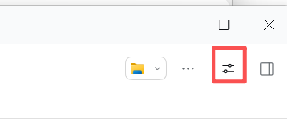

# DSH 环境变量管理器

在 DeepSeek Harness 桌面版中查看和编辑环境变量、`.env` 文件和密钥，支持 Windows 用户级与系统级环境变量。

## 安装

1. 打开桌面版，进入左侧的 **插件 → 添加插件**。
2. 在 **包名或地址** 中填写 `dsh-environment-tray`，点击 **安装**。
3. 安装完成后点击 **立即启用**。如果提示重启，按提示重启桌面版。

## 入口

回到会话页面，点击右上角的 **环境变量** 双滑杆按钮（下图红框）。新会话和已有会话都可以打开。

## 使用

- **查找变量**：在顶部搜索框输入变量名。
- **查看和复制**：点击值旁的眼睛或复制按钮。
- **修改值**：点击行尾的编辑按钮，按 Enter 或离开该行保存；按 Esc 取消。
- **新建变量**：点击顶部加号，填写名称和值、选择保存位置，再点击「新建」。
- **删除变量**：点击行尾的删除按钮，确认后删除所选位置中的值。

界面会显示变量的来源和生效状态；修改后如提示需要重启，按提示重启。
